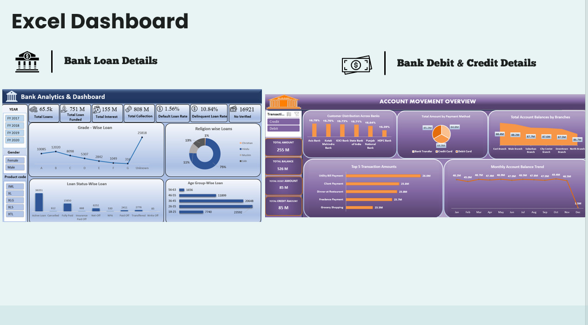
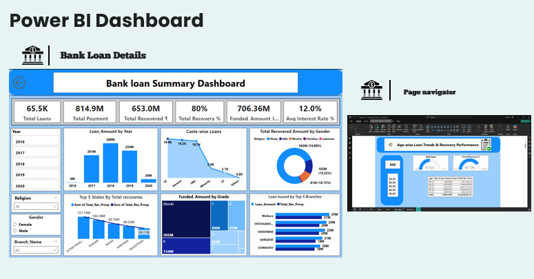
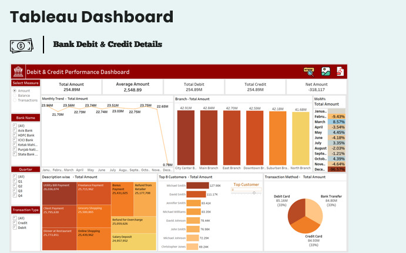

# 🏦 Banking Analytics & Fraud Detection System

A comprehensive system that combines **banking data analytics, business intelligence dashboards, and machine learning-based fraud detection** to derive insights and detect suspicious transactions.

<p align="center">
  
</p>

<p align="center">
  <a href="https://github.com/TechFreak2003/Banking-Analytics-Fraud-Detection/issues"></a>
  <a href="https://github.com/TechFreak2003/Banking-Analytics-Fraud-Detection/stargazers"></a>
  <a href="https://github.com/TechFreak2003/Banking-Analytics-Fraud-Detection/blob/main/LICENSE">
    
  </a>
</p>

<p align="center">
  <a href="#-features">Features</a> |
  <a href="#%EF%B8%8F-tech-stack">Tech Stack</a> |
  <a href="#-installation">Installation</a> |
  <a href="#-project-structure">Project Structure</a> |
  <a href="#-contributing">Contributing</a> |
  <a href="#%EF%B8%8F-author">Author</a>
</p>

<p align="center">
  
</p>

## 📸 Dashboard Previews

<p align="center">
  <br><br>
  <br><br>
  
</p>

---

## 🌟 Features

### 📊 Banking Analytics

* Analysis of debit and credit transactions
* Customer behavior insights and spending patterns
* Interactive dashboards using Excel, Power BI, and Tableau
* SQL-based querying for business insights

### 🤖 Fraud Detection

* Synthetic fraud labeling using rule-based logic
* Feature engineering (time-based + categorical encoding)
* Handling imbalanced datasets using SMOTE
* Machine learning model using XGBoost
* Modular pipeline (preprocessing → training → prediction)
* Anomaly detection using Isolation Forest

---

## 🛠️ Tech Stack

* **Programming**: Python, SQL
* **Libraries**: Pandas, NumPy, Scikit-learn, XGBoost, Imbalanced-learn
* **BI Tools**: Excel, Power BI, Tableau
* **Model Storage**: Joblib

---

## 🚀 Installation

### Requirements 📋

* Python 3.9+

### Getting Started 📜

1. **Clone the repository**:

```bash
git clone https://github.com/TechFreak2003/Banking-Analytics-Fraud-Detection.git
cd Banking-Analytics-Fraud-Detection
```

2. **Install dependencies**:

```bash
pip install -r requirements.txt
```

3. **Train the model**:

```bash
python src/train.py
```

4. **Run predictions**:

```bash
python src/predict.py
```

---

## 📁 Project Structure

```
BANKING-ANALYTICS/
├── Fraud_Detection/
│   ├── app/                     # Application layer (UI / interface)
│   ├── Data/                    # Raw banking datasets
│   ├── model/                   # Trained ML model (model.pkl)
│   ├── src/                     # Core ML pipeline
│   │   ├── preprocessing.py     # Data cleaning & labeling
│   │   ├── feature_engineering.py # Feature transformations
│   │   ├── train.py             # Model training script
│   │   └── predict.py           # Prediction logic
│   └── requirements.txt         # Dependencies
│
├── SQL/
│   └── SQL Project file.sql     # SQL analysis queries
│
├── Visuals/
│   ├── Excel_dashboard.jpg      # Excel dashboard snapshot
│   ├── Powerbi_Dashboard.jpg    # Power BI dashboard
│   └── Tableau_Dashboard.jpg    # Tableau dashboard
│
├── Excel/
│   ├── Excel Dashboard for Bank Data.xlsx
│   └── Excel Dashboard for Credit and Debit data.xlsx
```

---

## 👥 Contributing

Contributions are welcome! Please fork this repo and open a pull request.

* Bug fixes
* Improved fraud detection logic
* Additional analytics or dashboards
* Performance optimizations

---

## 👨‍💻 Author

| Avatar                                                                       | Name          | GitHub                                            | Role                 | Contributions                                     |
| ---------------------------------------------------------------------------- | ------------- | ------------------------------------------------- | -------------------- | ------------------------------------------------- |
|  | Suvrodeep Das | [TechFreak2003](https://github.com/TechFreak2003) | Creator & Maintainer | ML pipeline, analytics, dashboards, documentation |

---

## 📄 License

This project is licensed under the [MIT License](LICENSE).

---

> Crafted with ❤️ by Suvrodeep Das
